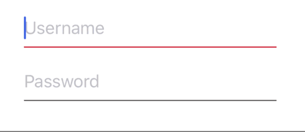

# FormTextField

Simple UITextField sublass adding the visibility of the placeholder during typing.

## Example

## How to use

### Configuration

You can change many settings on changing the configuration.

Create a new instance of `FormTextFieldConfiguration` with the desired parameters.

### Use FormTextField

There are two ways to use `FormTextField`:

1. In interface builder set the UITextField subclass to `FormTextField`.
You can then pass a configuration to your textField property.

2. Create an instance of `FormTextField` programmatically: `FormTextField(configuration: customConfiguration)`